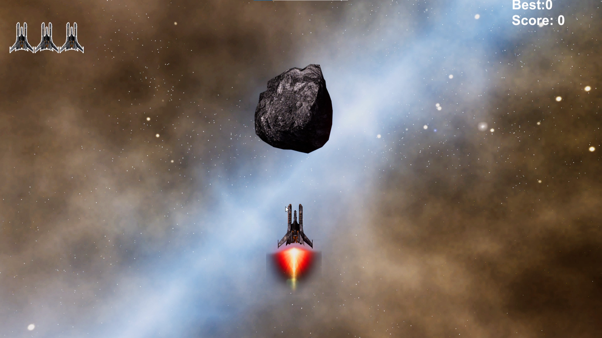

# 🚀 Space Invader

### A 2D Arcade Shooter developed with Unity

---

# 📖 Overview

**Space Invader** is a personal 2D arcade shooter developed in **Unity 6** using **C#**.

The project was created to strengthen my understanding of Unity's 2D game development workflow while implementing core gameplay mechanics such as player movement, enemy spawning, shooting, collision detection, score tracking, and game state management.

Inspired by the classic Space Invaders arcade game, this project focuses on clean gameplay, simple mechanics, and organized project structure.

---

# 🎥 Gameplay Video

Watch the gameplay demonstration here:

### ▶️ https://youtu.be/r3SOg-XIlqE

---

# 🛠️ Built With

| Category | Technology |
|-----------|------------|
| Game Engine | Unity 6000.0.57f1 |
| Programming Language | C# |
| IDE | Visual Studio |
| Version Control | Git & GitHub |

---

# ✨ Features

- Smooth 2D Player Movement
- Shooting System
- Enemy Spawn System
- Enemy Movement
- Collision Detection
- Score System
- Game Over Screen
- Main Menu
- Pause Menu
- Scene Management
- Background Music
- Sound Effects
- Clean 2D User Interface

---

# 📸 Gameplay Showcase

## 🏠 Main Menu

    

---

## 🎮 Gameplay

    

---

## 💥 Combat

    

---

## ☄️ Enemy Wave

    

---

# 🎯 Gameplay Mechanics

### Player

- 2D Player Controller
- Smooth Horizontal Movement
- Projectile Shooting

### Enemy

- Enemy Spawning System
- Enemy Movement
- Enemy Firing
- Collision Detection

### Game Systems

- Score Management
- Health / Lives System
- Game Over Screen
- Pause System
- Scene Management

### Audio

- Background Music
- Shooting Sound Effects
- UI Sound Effects

---

# 💻 Technologies Used

| Category | Technology |
|-----------|------------|
| Engine | Unity 6 |
| Language | C# |
| IDE | Visual Studio |
| Version Control | Git & GitHub |

---

# 📚 What I Learned

Developing this project helped me strengthen my understanding of Unity 2D game development, including:

- Building gameplay systems using C#
- Managing scenes and game states
- Designing modular gameplay logic
- Implementing collision-based interactions
- Creating responsive UI using Unity Canvas
- Organizing a Unity project for better maintainability
- Applying object-oriented programming concepts in game development

---

# 🎮 Development Highlights

Throughout this project I focused on writing clean and reusable gameplay logic while improving my understanding of Unity's 2D workflow.

The project demonstrates practical implementation of common arcade shooter mechanics and serves as one of my portfolio projects.

# 👨‍💻 My Role

This was a **personal portfolio project**, and I was responsible for the complete development process from start to finish.

### Responsibilities

- Designed and implemented the complete gameplay.
- Developed all game mechanics using C#.
- Created player movement and shooting systems.
- Implemented enemy spawning and movement.
- Developed the scoring and game state management systems.
- Designed and implemented the complete UI.
- Managed scenes, game flow, and project organization.
- Tested and debugged gameplay systems.

---

# 🎯 Skills Demonstrated

This project demonstrates my practical experience with:

- Unity 2D Game Development
- C# Programming
- Object-Oriented Programming (OOP)
- Gameplay Programming
- UI Development
- Collision Detection
- Scene Management
- Audio Integration
- Game State Management
- Problem Solving
- Debugging

---

# 📦 Assets

The visual assets used in this project were provided as part of a **Udemy game development course** and are used for educational and portfolio purposes.

The gameplay programming, project implementation, and integration were completed by me.

---

# 🚀 Future Improvements

Possible future improvements include:

- Multiple Enemy Types
- Boss Battles
- Power-Up System
- Particle Effects
- Improved Visual Effects
- Mobile Support
- Difficulty Levels
- Better UI Animations
- Achievement System
- High Score Leaderboard

---

# 📈 Project Outcome

This project was developed to strengthen my understanding of Unity game development and to practice implementing core 2D gameplay mechanics.

It also serves as a portfolio project showcasing my ability to build complete gameplay systems, organize Unity projects, and develop functional game prototypes using C#.

---

# 📬 Contact

**Zohaib Iqbal**

📧 Email: mr.zohaibiqbal19@gmail.com

🐙 GitHub: https://github.com/Zohaib-53

---

# 📄 License

This repository is shared for educational and portfolio purposes.

Please do not redistribute the project assets without following their respective license terms.

---

## ⭐ Thank You for Visiting!

If you enjoyed this project, consider giving this repository a ⭐.

I'm continuously learning and building new Unity projects to improve my game development skills.

